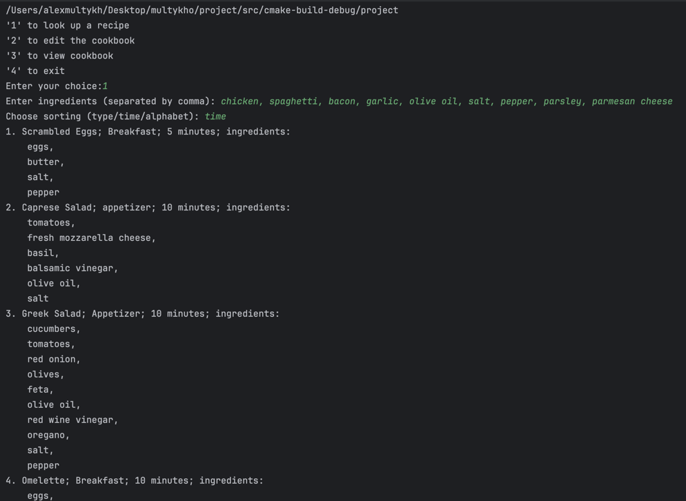
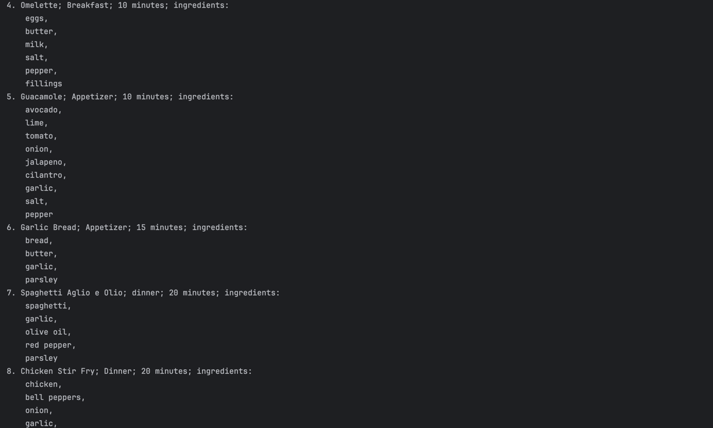
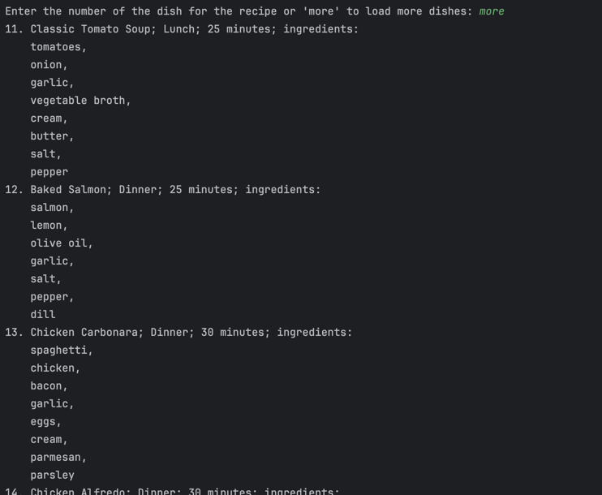
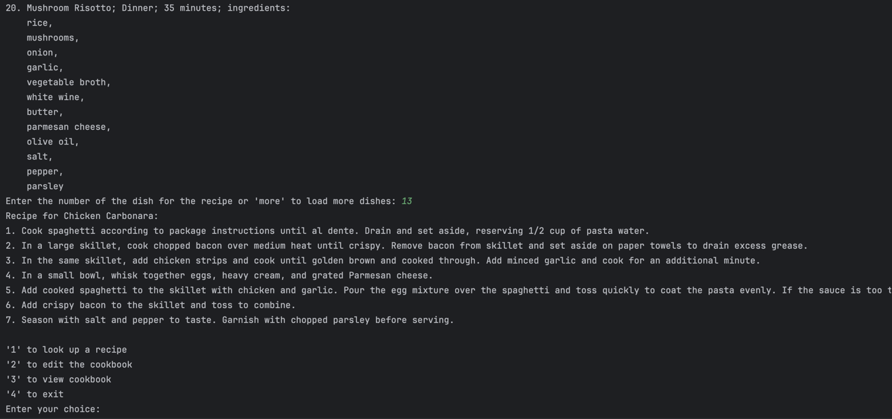
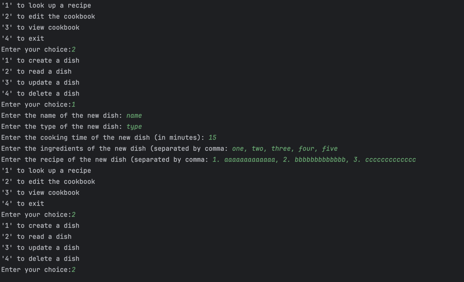
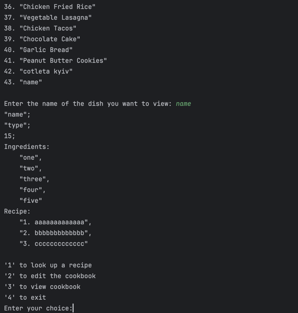

## After running the application, output will be displayed in the console.

### Here are the tests for the Kitchen Assistant application (inputs are in bold):

**Input:**
1

**Input:**
chicken, spaghetti, bacon, garlic, olive oil, salt, pepper, parsley, parmesan cheese

**Input:**
time

**Input:**
more

**Input:**
13

Output:
Recipe for Chicken Carbonara:
1. Cook spaghetti according to package instructions until al dente. Drain and set aside, reserving 1/2 cup of pasta water.
2. In a large skillet, cook chopped bacon over medium heat until crispy. Remove bacon from skillet and set aside on paper towels to drain excess grease.
3. In the same skillet, add chicken strips and cook until golden brown and cooked through. Add minced garlic and cook for an additional minute.
4. In a small bowl, whisk together eggs, heavy cream, and grated Parmesan cheese.
5. Add cooked spaghetti to the skillet with chicken and garlic. Pour the egg mixture over the spaghetti and toss quickly to coat the pasta evenly. If the sauce is too thick, add reserved pasta water a little at a time until desired consistency is reached.
6. Add crispy bacon to the skillet and toss to combine.
7. Season with salt and pepper to taste. Garnish with chopped parsley before serving.

'1' to look up a recipe
'2' to edit the cookbook
'3' to view cookbook
'4' to exit
Enter your choice:

**Input:**
2

**Input:**
1

Output:
Enter the name of the new dish:

**Input:**
cotleta

Output:
Enter the type of the new dish:

**Input:**
dinner

Output:
Enter the cooking time of the new dish (in minutes):

**Input:** 40

Output:
Enter the ingredients of the new dish (separated by comma):

**Input:**
meat, vegetables, spaghetti, pasta

Output:
Enter the recipe of the new dish (separated by comma):

**Input:**
1. Open fridge and get products, 2. Cook everything, 3. Serve hot, 4. Enjoy, 5. Do the dishes

Output:
'1' to look up a recipe
'2' to edit the cookbook
'3' to view cookbook
'4' to exit
Enter your choice:

**Input:**
3

Output:
The cookbook contains the following dishes:
1. "Chicken Carbonara"
2. "Spaghetti Aglio e Olio"
3. "Caprese Salad"
4. "Grilled Cheese Sandwich"
5. "Scrambled Eggs"
6. "Classic Tomato Soup"
7. "Chicken Stir Fry"
8. "Homemade Pizza"
9. "Pasta with Tomato Sauce"
10. "Baked Salmon"
11. "Vegetable Stir Fry"
12. "Homemade Mac and Cheese"
13. "Vegetable Soup"
14. "Spaghetti Bolognese"
15. "Chicken Alfredo"
16. "Beef Tacos"
17. "Caesar Salad"
18. "Chicken Caesar Wrap"
19. "Chicken Noodle Soup"
20. "Beef Stew"
21. "Spinach and Feta Stuffed Chicken Breast"
22. "Honey Garlic Shrimp"
23. "Mushroom Risotto"
24. "Lemon Garlic Roast Chicken"
25. "Pesto Pasta"
26. "Chocolate Chip Cookies"
27. "Banana Bread"
28. "Ratatouille"
29. "Guacamole"
30. "French Toast"
31. "Omelette"
32. "Greek Salad"
33. "Pancakes"
34. "Chicken Parmesan"
35. "Beef Burgers"
36. "Chicken Fried Rice"
37. "Vegetable Lasagna"
38. "Chicken Tacos"
39. "Chocolate Cake"
40. "Garlic Bread"
41. "Peanut Butter Cookies"
42. "cotleta"

'1' to look up a recipe
'2' to edit the cookbook
'3' to view cookbook
'4' to exit
Enter your choice:

**Input:**
2

Output:
'1' to create a dish
'2' to read a dish
'3' to update a dish
'4' to delete a dish
Enter your choice:

**Input:**
2

**Input:**
cotleta

Output:
"cotleta";
"dinner";
40;
Ingredients:
	"meat",
	"vegetables",
	"spaghetti",
	"pasta"
Recipe:
	"1. Open fridge and get products",
	"2. Cook everything",
	"3. Serve hot",
	"4. Enjoy",
	"5. Do the dishes"

'1' to look up a recipe
'2' to edit the cookbook
'3' to view cookbook
'4' to exit
Enter your choice:

**Input:**
2

**Input:**
3

Output:
The cookbook contains the following dishes:
1. "Chicken Carbonara"
2. "Spaghetti Aglio e Olio"
...

**Input:** cotleta
**Input:** cotleta kyiv
**Input:** breakfasr
**Input:** 13
**Input:** corn, pop, olive oil, pan
**Input:** 1. uehieufgeiufgwifhweiufg, 2. iufgeiufgeiufgeiufgweiufg, 3. uehfiuwegfiuyewgfie

Output:
'1' to look up a recipe
'2' to edit the cookbook
'3' to view cookbook
'4' to exit
Enter your choice:

**Input:**
2

**Input:**
2

The cookbook contains the following dishes:
1. "Chicken Carbonara"
2. "Spaghetti Aglio e Olio"
...
42. "cotleta kyiv"

Enter the name of the dish you want to view: cotleta kyiv
"cotleta kyiv";
"breakfasr";
13;
Ingredients:
	"corn",
	"pop",
	"olive oil",
	"pan"
Recipe:
	"1. uehieufgeiufgwifhweiufg",
	"2. iufgeiufgeiufgeiufgweiufg",
	"3. uehfiuwegfiuyewgfie"

'1' to look up a recipe
'2' to edit the cookbook
'3' to view cookbook
'4' to exit
Enter your choice:

**Input:**
4

Process finished with exit code 0

### How it should work:

### Check the cookbook for a new dish, then proceed.

